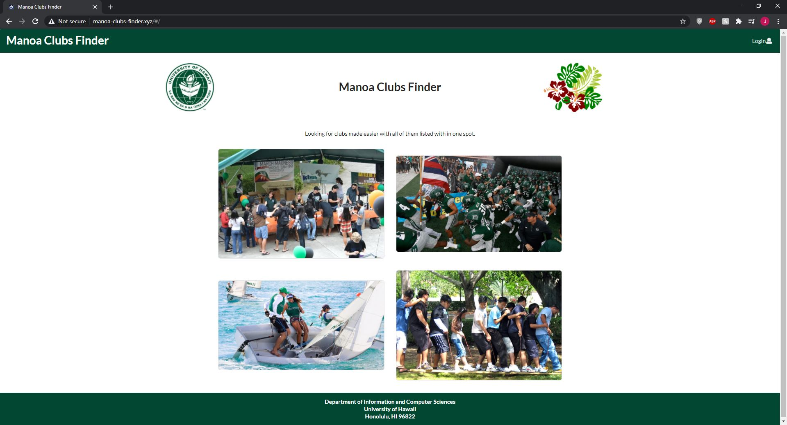

[Manoa Clubs Finder](https://manoa-clubs-finder.github.io/) is a web application that I built with two other people.

Manoa Clubs Finder is a web application that provides a centralized directory for UH Manoa student clubs. UH Manoa students can log in to browse a well-organized directory of all current student clubs, with brief descriptions, meeting times and locations, URLs to their websites (if any), contact information for officers, and a few select photos. Manoa Clubs Finder has three user roles, all of whom login with their UH ID. Regular users browse the directory. Club Admins have the ability to edit the data associated with their club. Super Admins make sure site content is appropriate and grant “club admin” privileges to selected users. Users can sort through all the clubs using categories or keywords and can specify interest areas, and be notified when a new club is created matching that interest area (or an existing club adds that interest area).

What I learned from this project is how to work in a group. We developed a sequence of Milestones that has a specified set of tasks. We split the tasks up with our group and did each task. After each task was done, we would deploy the code to the server and put all our code in the master branch in [github](https://github.com/manoa-clubs-finder/manoa-clubs-finder). We did this until our web application was functioning.

You can view the website at the [Manoa Clubs Finder](http://manoa-clubs-finder.xyz/#/). 

